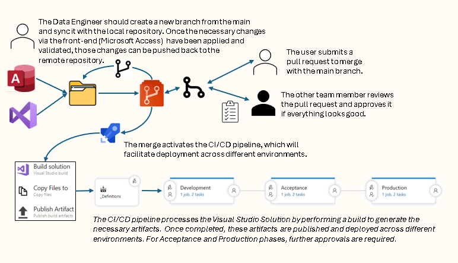

# __Data Ingestion / Transformation Requirements__
## *__How to capture them into (meta) data model and why you should!__*

by Mehmet (P.R.M.) Misset

##  __1. The General Idea__

<i>
    "Any project needs requirement to be written down, 
    why not do it in a structed way"
</i>

---

### __1.1. Requirements need gathering always__

In any (data) project, gathering requirements is a fundamental step. However, these requirements often remain scattered across various documents, emails, and meeting notes. By storing them in a structured way, such as a metadata model, you can ensure that all requirements are easily accessible, traceable, and manageable. This structured approach not only saves time but also reduces the risk of missing or misinterpreting requirements.

###	__1.2. It should be part of the development process__

Integrating the structured storage of requirements as part of the development process ensures that all team members have a clear understanding of what needs to be achieved. This integration promotes consistency and alignment across the project lifecycle, from initial planning to final deployment. By making it a standard practice, you can enhance collaboration and streamline the development process.

## __2. Why should you want to do this__

### __2.1 Standardization__

Standardizing the way requirements are captured and stored helps in maintaining uniformity across projects. It ensures that all team members follow the same procedures, making it easier to onboard new members and scale projects. Standardization also facilitates better communication and understanding among stakeholders, as everyone is on the same page regarding the project's goals and requirements.

### *Standardization will provide some key features that can be achieved*

> __Scalability:__ By defining only table definitions and transformations, the solution can scale efficiently. Automated checks for cardinality, uniqueness, validity, and consistency can be implemented. 

> __Compliance with Naming Conventions:__  Ensure compliance with naming conventions by storing transformation definitions in the database. Functional names can be automatically generated, with an override mechanism if needed. 

> __Parallel Processing:__ Splitting datasets and merging them later can improve performance, especially for large and wide datasets. Having this in a framework gives the engineers / developers the freedom to make parallel processing a conscious design choice. 

> __Vendor Independence:__ The solution can be implemented on various SQL engines like Databricks, Microsoft Fabric, Azure SQL Server, SkySQL,  DuckDB, any SQL Engine will do. This will ensuring vendor independence. Any SQL processing engine will be able to process the data pipeline that can be generated from the model.

### __2.2	Improved insight/visibility__

A structured approach to capturing requirements provides improved insight and visibility into the project's progress. It allows for easy tracking of changes, dependencies, and potential issues. With all requirements stored in a centralized location, stakeholders can quickly access and review them, leading to more informed decision-making and better project outcomes. 
Extraction of key Data management information like Datal Lineage and mapping to Business Data Glossaries is possible.

### __2.3. Automation__
Automation is a key benefit of storing requirements in a structured way. By leveraging tools and technologies, you can automate various aspects of the development process, such as generating documentation, validating requirements, and tracking changes. Automation reduces manual effort, minimizes errors, and accelerates the overall development timeline.

### *Some key aspects are*

> __Automatic Dependency Handling:__  
By storing definitions in the database, dependencies can be automatically managed and visualized through data-lineage graphs. Loop dependencies can automatically be detected and flagged during deployment. 

> __Technical Documentation:__ 
Generate technical documentation based on the metadata stored in the database. This can include links to business attributes from the Business Data Glossary. Small Data-Lineage graphs on the mapping of Transformations.  

> __Automatic Data-Lineage:__ 
Data-lineage can be automatically determined at the column level, providing detailed insights into data transformations. 

> __Easy Reloading:__ 
Reloading datasets can be simplified by restarting the data pipeline. If data is incorrect due to new insights or errors, the dataset can be dropped and reloaded, with dependent datasets automatically updated.
 
## 3. How to do this
3.1	Meta Data Model

[](https://mermaid.live/edit#pako:eNqFlFFr2zAUhf-KEBRaiNeWZukSxiCQMgYtjCbsYcse1PjGMYstI12HpUn---6VJTmpU-Y3XR0dfTq61k4udApyJMFMcpUZVczLeSnou7gQd8n0eZJMUWG-SJ5hCQbKBSQTharRpFj9mkse47aCufztyxvLZdjAWlcFlCjYo7ZRUBUZCb4r2g4QjPhqdF21s8ocz8b6Rq1PVv1Q67rdNFL3k8ls7CCTmVGlXWpT0Al0mYwNeHBYI1l9KzOwPCMeHmfRSCHPjRFN_lIjtNSpRX9aC3h0GMPlN1sRJUZFndquwvu0oqLqip5UVeVl1orUmb0i6pssKGWx3yeJ3nGkYiTmcqWs0CUIbUShDS2IiQclheyUuRW1hVSgFkQpFE_UcGmvPr-Y6y-XC10u86w2jkDkCAVNXQW_mFfHNSbuSZxbpBGxf8JC9vA4jEGHblXBfs_X6VTO7WQPV3mYPYqiSVJcC1fy_Oj4rTuAZfp4pQGAriXmgfk6f2WTJkJnxODBnCIICVATnXPgRD0UKpNxsOHyPHvwCka8OhgpbI0Yw-raLKA5UPR5B-J4bQvhHf4H0blPDojtKEabW6SrXDYYR83VnPKkVbnR0AbXIz_6Q05T7iCmze8SAE99Yx-bs46dsLyZj6pDw7n5vyWyYvXOrOzJAogjT-kV3bF6LnEFBbUzq1Jl_rDsQDpVo55uy4UcLdXaQk_Ss5et4qiuiAv8MxyrlSp_ak1jNHUzlKOd_CtHg8GH_qD_8Wb4aXjbvxve3_fkVo5uDj356vS3PQlpjto8NS-8e-gP_wCKRfXZ)

A metadata model is a framework that defines the structure and relationships of data elements within a system, here above a high over Entity Diagram is shown as example. To capture requirements in a metadata model, you need to identify the key data elements, such as datasets, attributes, transformations, and business keys. By defining these elements and their relationships, you create a comprehensive model that serves as a single source of truth for the project's requirements.

When ingesting datasets, it is essential to capture "*Source*" information, including details such as server, database, schema, table, user names, and potentially a query for SQL sources. For an API web interface, necessary information includes the base URL, relative URL, user credentials, and secrets stored in an Azure Key Vault (or a similar solution). These parameters can be standardized to streamline the process (see Parameter Group, Parameter and Parameter Value in de metadata model from above). Additionally, other sources such as Blob Storage require different parameters. By identifying these parameters, the requirement process can be clarified, ensuring that the necessary information is obtained efficiently.

---

<i>
    "Simplicity is the key to scalability,  
    complex logic where everything is done all at once because it can (or is demanded) 
    is not scalable, repeatable and often difficult to explain (in a later stage),  
    let alone knowledge wise transferable to new engineers."
</i>

---

To do “Data Transformations” a key requirement is writing down how this needs to be done, the business should provide the __*requirements*__ on what should end up in the dataset and what the use is and meaning in business teams (this is the __**functional**__ description of the __**dataset**__ and a list of __*attributes*__ also with functional names and descriptions.
The __*data engineer/modeler*__ can write the query to do this. Remember Simplicity is the key to scalability, complex logic where everything is done all at once because it can (or is demanded) is not scalable, repeatable and often difficult to explain (on a later stage), let alone knowledge wise transferable to new engineers. This means that initial logic/requirements of the business may be split out over multiple dataset/transformation. Reusability of repeating logic will cut down development time and improve uniformatity.

### *Integration with Data Management*

The framework already can provided "__*Data Lineage*__" based on the parsing of "__*Transformations*__". By ider providing "__*Business/Functional*__"-names and -descriptions "__*Data Definition*__" are covert. The *meta-data-model* can be used to reference "__*Busines Objects*__" from the "__*Data Glossary*__" this can be done by "__*ingestion*__" of the "__*Data Glossary*__" as datasets them selfs.
Integrating "__*Data Quality*__" is a logical next extention of the "*meta-data-model*", the aspects of this will be descussed in the next article (see [next topics](#5-next-topic)).
Extending the __*Dataset*__-information with "__*Data Owner*__ and __*User groups*__ data should have read access "__Data Security__"-component of the __*Data management*__ is covert as well.

### 3.2. Git-Repository and the development process

Using a Git repository for version control ensures that all changes to the metadata model are tracked and documented. By storing the metadata in a Git repository, you can maintain a history of modifications, revert to previous versions if needed, and collaborate with team members more effectively. Git also supports branching and merging, allowing multiple team members to work on different aspects of the model simultaneously without conflicts.

 "Development process")

The *development*-process as show here above has integrated the Git-repository with a *Frond-end*-tool (which describe in the next section).

### 3.3 A Front-End tool

A Front-end tool is technically not needed, however due to the relationship between datasets, attributes, parameters, transformations and every entry should be uniquely identifiable, a simple front-end tool is and would be nice. 

Microsoft Access makes a good candidate for a Front-End tool, programming is VBA well documented by Microsoft and the Microsoft Office suit is broadly adopted in many companies, if not a runtime-version is provided by Microsoft.

This tool should be programmed to extract the metadata from the repository and presented it in the form of menu`s, list- and detail-forms. Unique keys should be generated, drop-down-list should help providing correct values. When the metadata is changed the tool should update the relevant parts of the repository.

This front-end tool is if-self stored in the Git-repository, so updating the functionally of the tool is also part of the development process, this ensures the distribution is easily done by cloning the git repository. Some final requirements should be that it can run stand alone and requiring the minimal of other software to be installed. 

Microsoft Access makes a good candidate for a Front-End tool, programming is VBA well documented by Microsoft and the Microsoft Office suit is broadly adopted in many companies, if not a runtime-version is provided by Microsoft. The referenced Git repository, holds an example.

## 4. Conclusion

By capturing data ingestion and transformation requirements into a metadata model, you can achieve standardization, improved insight and automation. This structured approach not only enhances the development process but also ensures that all requirements are accurately captured, managed, and utilized throughout the project lifecycle.

### *Attachment*:

- Git Repository: [demo-analytic-data-platform](https://github.com/mehmetmisset/demo-analytic-data-platform/tree/adding-a-meta-data-model)(use the “adding-a-meta-data-model”-branch)

## 5. Next topic

1. Data Quality Requirements
2. A technical walkthrough in parsing SQL queries to extract data lineage information.
3. Utilizing the Meta Data to Generate Procedures for Incremental Data Transformations.
4. Building a Data Pipeline in Azure Data Factory
