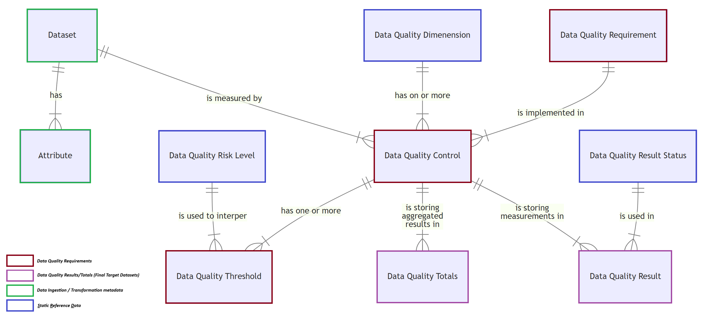

# __Data Quality Requirements__
## *__How to capture them into (meta) data model and why you should!__*

by Mehmet (P.R.M.) Misset

##  __1. The General Idea__

<i>
    "Let agree that the implementation of a `Data Quality`-requirement is in essence the same thing as a `Data Transformation`, with the special feature that the all the results of all the `Controls` end up in the same `target`-dataset."
</i>

---

### __1.1. Requirements need gathering always__

In any (data quality) project, gathering requirements is a fundamental step, data quality project this is no diffent, in in our previous article [Data Ingestion / Transformation Requirements](article-1-data-ingestion-transformation-requirements.md) we discussed the many benifites of captuing requirements in a *meta-data-model*. Let do a short summary

> 1. __*General Idea (the same goes for data quality):*__ Requirements should be documented in a structured way to ensure they are accessible, traceable, and manageable.
> 2. __*Importance of Requirements Gathering:*__ Gathering requirements is fundamental in any data project.
Storing requirements in a structured way saves time and reduces the risk of missing or misinterpreting them.
> 3. __*Integration into Development Process:*__ Integrating structured storage of requirements ensures consistency and alignment across the project lifecycle. Enhances collaboration and streamlines the development process.
> 4. __*Benefits of Standardization:*__ Maintains uniformity across projects. Facilitates better communication and understanding among stakeholders. Key features include scalability, compliance with naming conventions, parallel processing, and vendor independence.
> 5. __*Improved Insight and Visibility:*__ Provides better tracking of changes, dependencies, and potential issues. Centralized storage allows for quick access and review by stakeholders.
> 6. __*Automation:*__ Automates various aspects of the development process, reducing manual effort and minimizing errors. Key aspects include automatic dependency handling, technical documentation generation, automatic data lineage, and easy reloading of datasets.
> 7. __*Metadata Model:*__ Defines the structure and relationships of data elements within a system. Captures key data elements such as datasets, attributes, transformations, and business keys. Ensures necessary information is obtained efficiently.
> 8. __*Git Repository and Development Process:*__ Ensures all changes to the metadata model are tracked and documented. Supports branching and merging for effective collaboration.
> 9. __*Front-End Tool:*__ A simple front-end tool, like Microsoft Access, can help manage the metadata. Should be programmed to extract metadata from the repository and present it in a user-friendly way. Stored in the Git repository for easy distribution and updates.

At the end of the article the a conclusion was given as follows, *"Capturing data ingestion and transformation requirements into a metadata model enhances the development process. Ensures requirements are accurately captured, managed, and utilized throughout the project lifecycle."*

## 1.2. __*Data Quality*__ requirements

With the above in mind, the same priciples should be applied to gathering __Requirement__ for __*Data Quality*__. Where in de previous [article](article-1-data-ingestion-transformation-requirements.md) the main __*Requirements*__ were related to __*Datasets*__ and __*Attributes**__ in the case of __*Ingestion*__ parameters were involved, for __*Data Quality*__ 6 more types of __*Requirements*__ are needed. The list below will provide nice short and compact overview. The first 3 are fairly static and are mostly used ider describe properties of the __*DAta Quality Controls*__ or how the __*Results*__ should interpreted.

| __Name__   | __Description__ | Is Static | Responsiblily |
|:-----------|:----------------|:----------|:-------------|
| Result Status | This is the posible outcome of the __*Mesurement*__ done by the __*Data Quality Control*__, there a mainly 4 results, "OKE", "NOK", "OOS" (Out of Scope) and "UNK" (Unknown/Invalid). | Yes | Data Engineering |
| Risk Level | __*Data Quality Risk Level*__ refers to the potential impact and likelihood of data quality issues affecting an organization's operations, decision-making, and overall objectives. It assesses the severity of risks associated with poor data quality, such as inaccuracies, incompleteness, or inconsistencies, and helps prioritize areas that need attention. By evaluating the data quality risk level, organizations can implement appropriate measures to mitigate these risks and ensure reliable and accurate data for their needs. | Yes | Data Engineering |
| Dimensions | A __*Data Quality Dimension*__ is a specific aspect or characteristic used to evaluate the quality of data. These dimensions provide a framework for assessing how well data meets the needs of its intended use. Each dimension focuses on a different attribute of data, such as accuracy, completeness, consistency, and timeliness, among others. By examining these dimensions, organizations can ensure their data is reliable, accurate, and fit for purpose. | Yes | Data Engineering |
| Requirements | A __*Data Quality Requirement*__ is a specific criterion or standard that data must meet to be considered acceptable for its intended use. These requirements are defined based on the needs of the organization and the context in which the data will be used. They ensure that data is fit for purpose by specifying the necessary levels of accuracy, completeness, consistency, timeliness, and other quality dimensions. Meeting these requirements is crucial for reliable data analysis, decision-making, and operational efficiency. | No | Business |
| Control | __*Data Quality Control*__ refers to the implementation of the __*Data Quality Requirement*__ on specific dataset(s)/record(s). The __*Data Quality Control*__ is also linked to the __*Data Quality Dimension*__ and containts the __*Query*__ that should be executed to determine the __*Data Quality Results*__. | No | Business / Data Engineer |
| Threshold | Data Quality Thresholds are predefined limits or criteria that data must meet to be considered acceptable for its intended use. These thresholds are set based on the specific quality dimensions, such as accuracy, completeness, and consistency. They serve as benchmarks to evaluate whether data meets the required standards. For example, a threshold might specify that no more than 2% of data entries can be missing for the dataset to be deemed complete. By establishing these thresholds, organizations can systematically assess and ensure the quality of their data. | No | Business |

We should hold in mind that __*Data Quality Controls*__ are related to a __*Dataset*__ the __*Data Quality Requirements*__ are NOT. The entity diagram of the next section shows the relationship between the diffent __*Requirements*__.
The final to 2 entities in the __*Datamodel*__ are __*Data Quality Results*__ and __*Data Quality Totals*__, these are NOT requirements that need to be gather, but are the __*target*__-datasets of any __*Data Quality Control*__. Here the __*Data Quality Results*__ is where the outcome of the measurement for the __*Data Quality Control*__ is strored, here to reference to individual records by __*businesskey*__ is posible (the struction of the table should support multiple businesskey, how many depends on business requirements, for example if there are many __*Data Quality Controls*__ with 4 involved __*datasets*__ all should support max 4 __*businesskeys*__). The results are counted and aggregated over the __*Data Quality Result Status*__ into __*Data Quality Totals*__. By joining the __*Data Quality Totals*__ with the __*Data Quality Thresholds*__ a interpretation can be done and the __*Data Quality*__ of the __*Dataset*__  classified on the level of a __*Data Quality Control*__ and for __*Dataset*__ as a whole. 

In short the "__*Target*__"-datasets for __*Data Quality Results*__ and __*Data Quality Totals*__ have a perdictable format,see listing below (inline with the 4 __*businesskeys*__-example to illustate ther required attributes). 
 
 - __*Data Quality Results*__ 
   - Businesskey Value of Dataset 1 (Main dataset being measured)
   - Businesskey Value of Dataset 2 (If 2nd dataset is involved reference the related Businesskey.)
   - Businesskey Value of Dataset 3 (If 3rd dataset is involved reference the related Businesskey.)
   - Businesskey Value of Dataset 4 (If 4th dataset is involved reference the related Businesskey.)
   - Data Quality Result Status (OKE, NOK or OOS)
    
 - __*Data Quality Totals*__
   - \# OKE (count of records that reference "OKE")
   - \# NOK (count of records that reference "NOK")
   - \# OOS (count of records that reference "OOS")

Now we that we know what __*Requirements*__ are needed, the __*meta-data-mode*__ needs to be extented.  

### Extented meta-data-model with __*Data Quality*__-requirements

## 1.3. front-end tooling

In the previous article a front-end tool was discussed, what good candidate was and why we should want on. The same arguments are here also valid, even more so where meta-data-model is a bit more complex. To summarize a short list:
> 1. __*User-Friendly Interface*__: Access provides a straightforward, user-friendly interface for creating forms, queries, and reports, making it easy to manage and interact with your data.
> 2. __*VBA Integration*__: With Visual Basic for Applications (VBA), you can automate tasks, create custom functions, and enhance the functionality of your tool.
> 3. __*Broad Adoption*__: Microsoft Office, including Access, is widely used in many organizations, ensuring compatibility and ease of use for many users.
> 4. __*Runtime Version*__: Microsoft offers a runtime version of Access, allowing users without the full Office suite to run Access applications.
> 5. __*Standalone Operation*__: Access applications can run independently with minimal additional software requirements, making them convenient for users.

A effort should be undertaken to adjust the Microsoft Access Application so it can handle the additional tables so easy maintaince of the metadata for the __*Requirements*__ related to __*Data Quality*__ is feasiable. The referenced git-repository [demo-analytic-data-platform]([https://github.com/mehmetmisset/demo-analytic-data-platform/tree/adding-a-meta-data-model](https://github.com/mehmetmisset/linkedin-article-1-data-ingestion-transformation-requirements/tree/main)) from the previous [article](article-1-data-ingestion-transformation-requirements.md) proivide a fair bare minimal version, specific adjustsment to suit business need is allowed within the provided licence.

# 2 How to use these __*Requirements*__?

After extending the data model in the database and adjusting the front-end tooling, we are ready to proceed. The next step involves defining Data Quality Controls and their associated requirements. Once several requirements have been added, a crucial question arises: how can we ensure that all source datasets are updated before processing them?

The solution lies in reusing the existing processing logic required for data transformations. To achieve this, the requirements of the Data Quality Controls must be converted into dataset and attribute metadata definitions. Fortunately, the structure of the dataset/attribute target is highly predictable, allowing for automatic deployment of these metadata definitions to the database.

This process can be broken down into three stages:

1. Conversion: Convert the Data Quality Control requirements into dataset and attribute definitions.
2. Generation: Generate dataset and attribute definitions by uniting individual Data Quality Result datasets until only two remain.
3. Transformation: Transform these two aggregated datasets into a final Data Quality Result dataset. The same stages apply to aggregate individual Data Quality Totals datasets into the final Data Quality Totals dataset.

By following these stages, we can ensure that the source datasets are updated and the Data Quality Controls are effectively implemented. The SQL solution for this can be found in the [git repository](https://github.com/mehmetmisset/linkedin-article-1-data-ingestion-transformation-requirements/blob/main/demo-analytic-data-platform/2-meta-data-definitions/9-Depoyment/1-Scripts/0-Temporal-Objects/Script.usp_insert_dq_controls_as_datasets.sql) mentioned below, the script is located here `\2-meta-data-definitions\9-Depoyment\1-Scripts\0-Temporal-Objects\Script.usp_insert_dq_controls_as_datasets.sql`

While this approach offers great flexibility for parallel or individual processing of Data Quality Controls, it results in two datasets per control. These intermediate datasets are placed into separate schemas and have technical names. Managing hundreds or even thousands of such datasets is impractical.

The solution is to aggregate all these datasets into a single Data Quality Result dataset and a Data Quality Totals dataset, both of which should be readable by data stewards, analysts, and scientists. Given that the definitions of individual Data Quality Control transformations are known (as mentioned in the conversion process), a script can be implemented to automatically create dataset and attribute definitions for transforming and uniting the individual Data Quality Result datasets in pairs. This union process continues until only two datasets remain. Finally, a last union transformation is created, targeting the final Data Quality Result dataset. The SQL solution for this can be found in the [git repository](https://github.com/mehmetmisset/linkedin-article-1-data-ingestion-transformation-requirements/blob/main/demo-analytic-data-platform/2-meta-data-definitions/9-Depoyment/1-Scripts/0-Temporal-Objects/Script.usp_insert_dq_aggregates_as_datasets.sql) mentioned below, the script is located here `\2-meta-data-definitions\9-Depoyment\1-Scripts\0-Temporal-Objects\Script.usp_insert_dq_aggregates_as_datasets.sql`

## Why should we do this, in this way?

Maintaining the requirements related to Data Quality offers several benefits. By storing these requirements within the dataset, many tasks can be automated, including execution and scheduling through incremental loading. This automation frees up time for business data stewards and data engineers, allowing them to focus on building accurate queries to measure Data Quality Requirements. With the framework discussed in the previous article (Data Ingestion / Transformation Requirements), pre-processed datasets can be created whenever needed.

Additional deployment logic can be introduced to extract not only the Data Lineage but also the Involved Data Items per Data Quality Control and Data Quality Result Status, providing detailed insights at the attribute level. Since all Data Quality Controls are designed to be standalone, they can be processed in parallel with incremental loading (all datasets should have technically valid from and till datetimes). Given the predictable structure of the datasets, aggregating the results can be automated similarly to generating the required dataset/attribute metadata definitions.

The benefits can be summarized as follows:

- Processing order is automatically determined.
- ETL for incremental loading is generated in a generic way.
- Data Lineage is extracted in the same way as other Data Transformations.
- Extraction of Involved Data Items can be automated.
- Execution of Data Quality Controls can be done in parallel.
- Aggregation in ETL is automatically generated, reducing errors.
- Vendor independence: this approach works with any SQL processing engine (SQL Server, Databricks, Fabric).
- Maximized flexibility.

# Conclusion

Capturing data quality requirements into a metadata model is a crucial step in ensuring the reliability and accuracy of data within an organization. By documenting these requirements in a structured and accessible manner, we can streamline the development process, enhance collaboration, and maintain consistency across projects. The integration of data quality controls into the metadata model allows for automated processing, improved tracking, and better visibility of data quality issues.

Implementing this approach offers numerous benefits, including automation of tasks, standardization of processes, and vendor independence. By leveraging tools like Microsoft Access for managing metadata, organizations can ensure that data quality requirements are effectively captured, managed, and utilized throughout the project lifecycle. This not only saves time and reduces errors but also provides a scalable and flexible framework for maintaining high data quality standards.

In summary, embedding data quality requirements into a metadata model is a strategic move that enhances the overall data management process, ensuring that data remains fit for purpose and supports informed decision-making.

### *Attachment*:

- Git Repository: [demo-analytic-data-platform](https://github.com/mehmetmisset/linkedin-article-1-data-ingestion-transformation-requirements/tree/main)
- [Data Ingestion / Transfromation Requirements](demo-analytic-data-platform\articles\article-1-data-ingestion-transformation-requirements.md)

### Next topic

1. A technical walkthrough in parsing SQL queries to extract data lineage information.
2. Utilizing the Meta Data to Generate Procedures for Incremental Data Transformations.
3. Building a Data Pipeline in Azure Data Factory
